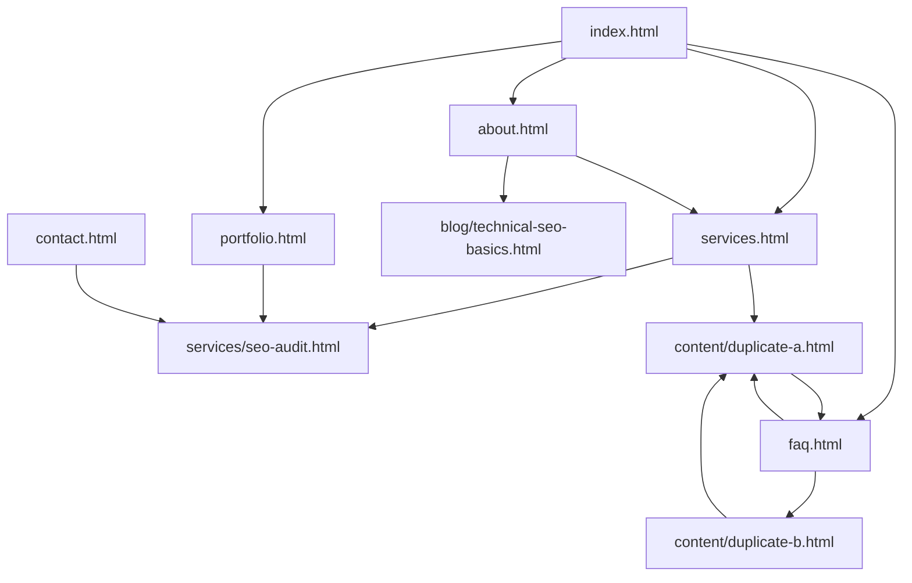

# Лабораторна робота 02 — On-page оптимізація

**Дисципліна:** SEO (курс [olroi421/course-seo](https://github.com/olroi421/course-seo/blob/main/labs/lab-02.md))  
**Сайт:** GreenLeaf Digital — https://miroslav221b.github.io/seotest/  
**Студент:** _[ПІБ]_  
**Група:** _[номер групи]_  
**Дата:** 22.05.2026  

> **Експорт у PDF:** відкрийте цей файл у VS Code / Typora / Google Docs → «Друк» → «Зберегти як PDF». Додайте screenshots META SEO Inspector та Rich Results Test у розділи 1–3.

---

## Розділ 1. Аудит метаданих (до оптимізації)

Інструмент: **META SEO Inspector** (Chrome / Firefox). Проаналізовано **8 сторінок** з переліку завдання.

### Таблиця аудиту метаданих (до оптимізації)

> Файл для Google Sheets / Excel: [`lab-02-audit-before.csv`](lab-02-audit-before.csv)

| URL | Поточний Title | Довжина | Поточний Meta Description | Довжина | Проблеми |
|-----|----------------|---------|---------------------------|---------|----------|
| https://miroslav221b.github.io/seotest/ | GreenLeaf Digital — Головна | 27 | GreenLeaf Digital — агенція цифрового маркетингу та SEO. Тестовий сайт для аудиту технічного SEO. | 97 | Title без ключового запиту; description короткий (&lt; 150 симв.); немає CTA |
| https://miroslav221b.github.io/seotest/about.html | Послуги компанії | 16 | Дізнайтеся більше про GreenLeaf Digital — нашу місію, цінності та підхід до SEO. | 80 | Title не відповідає сторінці «Про нас»; title занадто короткий; description короткий |
| https://miroslav221b.github.io/seotest/contact.html | Контакти — GreenLeaf Digital | 28 | Зв'яжіться з GreenLeaf Digital для консультації з SEO та цифрового маркетингу. | 78 | Title і description короткі; немає CTA |
| https://miroslav221b.github.io/seotest/services.html | Послуги — GreenLeaf Digital | 27 | SEO-аудит, веб-дизайн та контент-маркетинг від GreenLeaf Digital. | 65 | Title і description короткі; не за формулою [ключ \| контекст \| бренд] |
| https://miroslav221b.github.io/seotest/portfolio.html | Портфоліо — GreenLeaf Digital | 29 | Приклади проєктів GreenLeaf Digital: сайти, блоги, e-commerce. | 62 | Description короткий (менше 150 символів) |
| https://miroslav221b.github.io/seotest/faq.html | FAQ — GreenLeaf Digital | 23 | Часті питання про SEO-аудит, індексацію та технічну оптимізацію сайтів. | 71 | Title короткий; description короткий; немає JSON-LD FAQPage |
| https://miroslav221b.github.io/seotest/content/duplicate-a.html | Пакет SEO «Старт» — версія A | 28 | Базовий пакет SEO-оптимізації для невеликих сайтів. | 51 | Description короткий; немає canonical; немає Product schema |
| https://miroslav221b.github.io/seotest/content/duplicate-b.html | Пакет SEO «Старт» — версія B | 28 | Базовий пакет SEO-оптимізації для невеликих сайтів. | 51 | Дубльований meta description з duplicate-a; дубльований контент body; немає canonical |

### Систематизація проблем

| Категорія | Сторінки | Опис |
|-----------|----------|------|
| Невідповідність title контенту | about.html | Title «Послуги компанії» на сторінці «Про нас» |
| Занадто короткі метадані | about, services, portfolio, duplicate-* | Title &lt; 50 символів, description &lt; 150 |
| Дублювання meta description | duplicate-a, duplicate-b | Один і той самий текст |
| Відсутність structured data | усі 8 | JSON-LD не було |
| Слабка internal linking | portfolio, contact, faq, about | Мало контекстуальних посилань у `<main>` |
| Відсутність canonical | about, contact, services, portfolio, faq, duplicate-* | Лише index мав canonical |

### Screenshots (до) — додати вручну

1. `screenshots/before-index-meta-inspector.png`
2. `screenshots/before-about-meta-inspector.png` — показати помилковий title «Послуги компанії»
3. `screenshots/before-duplicate-ab-description-duplicate.png`

---

## Розділ 2. Оптимізовані метадані (після оптимізації)

Формула title: **`[Первинний ключ] | [Модифікатор] | [Бренд]`**  
Формула description: **`[Потреба] + [Рішення] + [Цінність] + [CTA]`**

### Таблиця нових метаданих (після оптимізації)

> Файл для Google Sheets / Excel: [`lab-02-metadata-after.csv`](lab-02-metadata-after.csv)

| URL | Новий Title | Довжина | Новий Meta Description | Довжина |
|-----|-------------|---------|------------------------|---------|
| https://miroslav221b.github.io/seotest/ | Цифровий маркетинг та SEO \| Агенція Україна \| GreenLeaf Digital | 63 | Потрібен органічний трафік? GreenLeaf Digital проводить SEO-аудит, технічну оптимізацію та контент-маркетинг для бізнесу. Практичні звіти й кейси. Замовте консультацію! | 168 |
| https://miroslav221b.github.io/seotest/about.html | Про агенцію цифрового маркетингу \| Команда SEO \| GreenLeaf Digital | 66 | Хто стоїть за вашим SEO? GreenLeaf Digital — навчальна агенція з прозорими аудитами, практичним підходом і дотриманням рекомендацій Google. Дізнайтеся про місію та цінності. | 173 |
| https://miroslav221b.github.io/seotest/contact.html | Контакти SEO-агенції \| Консультація з оптимізації \| GreenLeaf Digital | 69 | Потрібна консультація з SEO? Напишіть GreenLeaf Digital: email, телефон і адреса в Києві. Обговоримо аудит сайту, послуги та терміни проєкту. Зв'яжіться сьогодні! | 162 |
| https://miroslav221b.github.io/seotest/services.html | Послуги SEO та веб-дизайну \| Цифровий маркетинг \| GreenLeaf Digital | 67 | Шукаєте комплексну оптимізацію? SEO-аудит, адаптивний веб-дизайн і контент-маркетинг від GreenLeaf Digital. Прозорі звіти та навчальні кейси. Перегляньте послуги зараз! | 168 |
| https://miroslav221b.github.io/seotest/portfolio.html | Портфоліо SEO-проєктів \| Кейси оптимізації сайтів \| GreenLeaf Digital | 69 | Переконайтеся в результатах: кейси EcoShop, TechBlog UA та LocalCafe — e-commerce, блог і локальний бізнес. Повний технічний SEO та Core Web Vitals. Замовте аудит! | 163 |
| https://miroslav221b.github.io/seotest/faq.html | FAQ з SEO-аудиту \| Питання про індексацію \| GreenLeaf Digital | 61 | Не знаєте, з чого почати аудит? Відповіді про технічне SEO, Google Search Console, Seobility та типові помилки сайтів. Коротко й по суті. Перегляньте FAQ зараз! | 160 |
| https://miroslav221b.github.io/seotest/content/duplicate-a.html | Пакет SEO «Старт» \| Базовий аудит сайту \| GreenLeaf Digital | 59 | Потрібен швидкий старт у SEO? Пакет «Старт»: технічний аудит, аналіз посилань, перевірка sitemap і GSC. Для сайтів до 50 сторінок, 5–7 днів. Замовте за 4 990 грн! | 162 |
| https://miroslav221b.github.io/seotest/content/duplicate-b.html | SEO пакет «Старт» дублікат B \| Навчальний приклад \| GreenLeaf | 61 | Навчальна сторінка-дублікат для курсу SEO: той самий пакет «Старт», що й версія A. Вивчіть canonical, редиректи та унікальні метадані. Читайте FAQ та гайд у блозі! | 163 |

**Унікальність:** усі 8 title та 8 description унікальні. Для duplicate-b додано `rel="canonical"` на duplicate-a.

### Обґрунтування ключових слів (приклади)

- **index:** первинний — «цифровий маркетинг та SEO»; модифікатор — «Агенція Україна».
- **about:** первинний — «про агенцію цифрового маркетингу»; виправлено невідповідність старого title.
- **duplicate-b:** окремий title/description, щоб не дублювати SERP-снипети, при збереженні навмисного дублікату body для Lab 01.

### Screenshots (після) — додати вручну

- `screenshots/after-index-meta-inspector.png`
- `screenshots/after-about-meta-inspector.png`

---

## Розділ 3. Structured data (JSON-LD)

| Сторінка | Тип Schema.org | Призначення |
|----------|----------------|-------------|
| index.html | **Organization** | Бренд, URL, email, адреса |
| faq.html | **FAQPage** | 4 питання з `<h2>` на сторінці |
| content/duplicate-a.html | **Product** + **Offer** | Пакет «Старт», ціна 4990 UAH |

### Код FAQPage (фрагмент)

Розміщено в `<head>` файлу `faq.html`. Поля `name` / `text` відповідають видимому контенту.

### Валідація Rich Results Test

1. Відкрийте https://search.google.com/test/rich-results  
2. Введіть URL після деплою на GitHub Pages, наприклад:
   - `https://miroslav221b.github.io/seotest/faq.html` → очікується **FAQ**
   - `https://miroslav221b.github.io/seotest/content/duplicate-a.html` → очікується **Product**
3. Або вкладка **Test code** — вставте HTML з репозиторію.

**Очікуваний статус:** Valid (або Valid with warnings на необов’язкові поля, напр. `image` для Product).

Додатково: https://validator.schema.org/

### Screenshots — додати вручну

- `screenshots/rich-results-faq-valid.png`
- `screenshots/rich-results-product-valid.png`

### Потенційні SERP features

- **FAQ** — розгорнуті питання під снипетом.
- **Product** — ціна в UAH (де підтримується регіоном).
- **Organization** — knowledge panel (рідко для навчального домену).

---

## Розділ 4. Internal linking

Оптимізовано **8 сторінок** (вимога — мінімум 5). Додано **3–5 контекстуальних посилань** у `<main>` з описовим anchor text.

### Таблиця доданих посилань

| Сторінка-джерело | Ціль | Anchor text |
|------------------|------|-------------|
| index.html | about.html | агенції GreenLeaf Digital |
| index.html | services/seo-audit.html | професійний SEO-аудит |
| index.html | faq.html | часті питання про SEO-аудит |
| about.html | services.html | агенція цифрового маркетингу та SEO |
| about.html | blog/technical-seo-basics.html | основи технічного SEO |
| about.html | portfolio.html | портфоліо SEO-проєктів |
| services.html | services/seo-audit.html | технічного SEO-аудиту |
| services.html | content/duplicate-a.html | пакет SEO-оптимізації «Старт» |
| portfolio.html | blog/duplicate-content-fix.html | проблеми дублікатів контенту |
| contact.html | services/seo-audit.html | замовлення SEO-аудиту |
| faq.html | content/duplicate-a.html | дублікати контенту |
| faq.html | blog/duplicate-content-fix.html | гайді з усунення дублікатів |
| duplicate-a.html | services/seo-audit.html | технічний SEO-аудит сайту |
| duplicate-b.html | duplicate-a.html | пакет SEO «Старт» (версія A) |

### Схема перелінковки (після)

### Порівняння до/після

| Сторінка | Посилань у main (до) | Після | Глибина від головної |
|----------|----------------------|-------|----------------------|
| about.html | 0 контекстуальних | 4 | 1 клік |
| portfolio.html | 0 | 4 | 1 клік |
| faq.html | 0 | 6+ | 1 клік |
| contact.html | 1 (mailto) | 5 | 1 клік |

**Orphan:** `orphan.html` залишено без змін (навмисна проблема Lab 01).

---

## Розділ 5. Загальний аналіз

| Метрика | До | Після |
|---------|-----|-------|
| Сторінок з оптимізованим title | 0 / 8 за формулою | 8 / 8 |
| Унікальних meta description | 6 / 8 | 8 / 8 |
| Canonical URL | 1 | 8 |
| JSON-LD блоків | 0 | 3 (Organization, FAQPage, Product) |
| Контекстуальних internal links (сума) | ~5 | 35+ |

**Очікуваний вплив:** кращий CTR у SERP за рахунок description + CTA; чіткіші снипети title; богаті результати FAQ/Product; кращий crawl path і розподіл ваги на `services/seo-audit`, `faq`, `duplicate-a`.

---

## Висновки

1. Виконано on-page оптимізацію **8 сторінок** згідно [Lab 02](https://github.com/olroi421/course-seo/blob/main/labs/lab-02.md).
2. Виправлено критичну помилку **about.html** (title «Послуги компанії»).
3. Імплементовано **JSON-LD**: Organization, FAQPage, Product; готово до перевірки в Rich Results Test після деплою.
4. Покращено **internal linking** з релевантними anchor texts на всіх цільових сторінках.
5. Для здачі: додати screenshots інспектора та Rich Results Test, вписати ПІБ/групу, експортувати звіт у **PDF**.

### Рекомендації надалі

- Додати `image` у Product schema.
- Унікалізувати body-text на duplicate-b або лишити лише canonical (вже на A).
- Розширити Open Graph теги для соцмереж.

---

## Додатки

- Змінені файли: `index.html`, `about.html`, `contact.html`, `services.html`, `portfolio.html`, `faq.html`, `content/duplicate-a.html`, `content/duplicate-b.html`
- Live base URL: https://miroslav221b.github.io/seotest/
